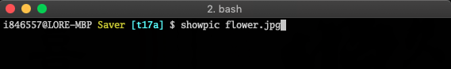
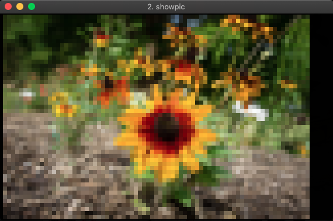
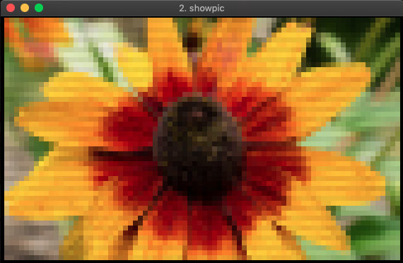

# showpic

Shows images on your terminal.

To use truecolor, make sure your terminal reports `xterm-truecolor` or set `TERM` to `xterm-truecolor`. Otherwise, 256-color mode would be used.

## Sample

Run the command:

Initial view:

Zoom and pan: Use the arrow keys to pan and `+`/`-` to zoom. `0` restores the zoom.

